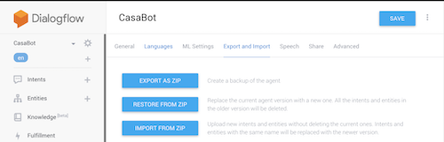

# Home Loan Chatbot (Casabot) with Dialogflow

<https://github.com/knightfall/UTS-RP19-OSHC_CHATBOT>

41004: Analytics Capstone Project Deliverable, Autumn 2019.

Subject Coordinator: [Dr. Wei Liu](https://www.uts.edu.au/staff/wei.liu)
Supervisor: [Dr. Wei Liu](https://www.uts.edu.au/staff/wei.liu)

## Table of Contents

1. [About](#markdown-header-about)
2. [Demo](#markdown-header-demo)
3. [Prerequisities](#markdown-header-prerequisites)
4. [Installation](#markdown-header-installation)
5. [Sample Questions](#markdown-header-ample-questions)
6. [Further Development](#markdown-header-further-development)
7. [Final Words](#markdown-header-final-words)

## About

Overseas Student Health Cover is the health insurance which allmost all of the international students in Australia have to purchase before applying for student visa.
This chatbot intends to educate current and prospective international students in Australia about their OSHC cover, who are the providers and how much do they cost.
(David)

## Demo

To see the working demo, click on the following links

- [Dialogflow Instant Chat](https://bot.dialogflow.com/CasaBot)
- [Facebook Messenger](m.me/400454180513269)

## Prerequisites

To run the chatbot in you will need to have the following

- [Free Dialogflow account](https://console.dialogflow.com)
- [Google Drive Account](https://drive.google.com/drive/u/0/) - Google Sheet Setup.

## Installation

### Step 1. Dialogflow

#### a. Create your free [Dialogflow](<https://dialogflow.com/docs/getting-started/create-account>) account

#### b. Create the agent

#### c. Go to 'Settings' beside Agents list on top left below Dialogflow icon. Then, access the 'Export and Import' tab. Finally, click the 'Restore From Zip' button

#### d. Drop the cloned Casabot.zip files and then click the 'Restore' button

#### e. Move to 'Fulfillment' tab on the center of the left navigation bar (the one with thunder-like icon). Enable the Webhook and then fill in the URL to handle the webhook requests (you can also use our default one, but you would need to use your own URL to modify the bot behaviour)

#### f. Go to 'Integrations' tab below 'Fulfillment' and choose any platform that you would like to integrate with

### Step 2. GoogleSheets Setup (Jojo)

-- David --

## Sample Questions

## Further Development

## Final Words
